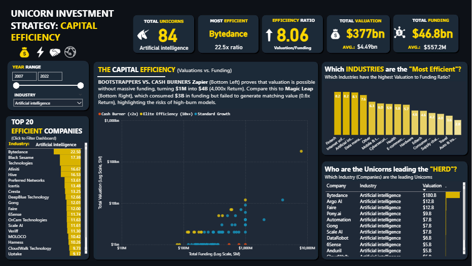
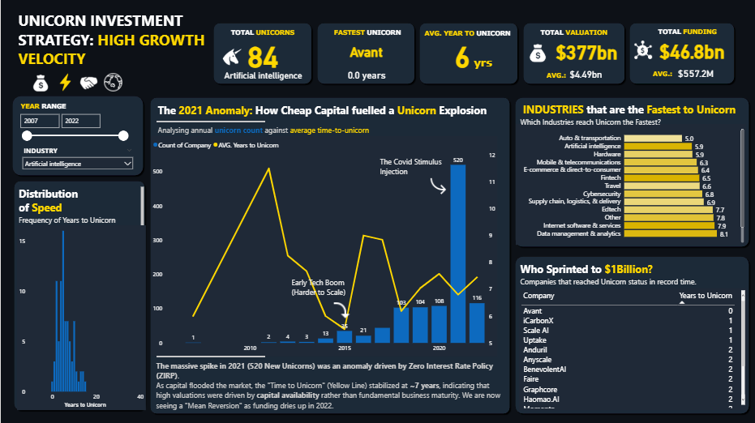
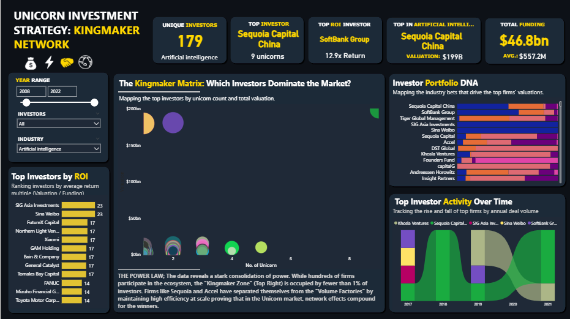

# Global Unicorn Arbitrage: Ecosystem Efficiency Dashboard
Identifying high-ROI "Emerging Efficiency Hubs" vs. saturated "Premium Markets" for venture capital allocation

## 📄Project Overview
This Power BI project analyzes the landscape of "Unicorn" companies **(startups valued at $1B+)** to identify optimal investment strategies. Moving beyond simple counts, this dashboard uses a "Geography Arbitrage" framework to classify global ecosystems into "Emerging Efficiency Hubs" (Low Entry Price, High Opportunity) versus "Premium Saturated Hubs" (High Entry Price, High Stability)

---

### 📊Dashboard Preview and insight 
#### A PowerBI dashboard used to visualize the analysis can be found here →[Link to Global Unicorn Arbitrage: Ecosystem Efficiency Dashboard](https://app.powerbi.com/links/NDQXqXVVke?ctid=319a61c8-ee1e-4161-8f35-b9553227afd7&pbi_source=linkShare&bookmarkGuid=6aa14441-554f-4a07-b90e-b58e37eac958)

### 💰CAPITAL EFFICIENCY (The Moneyball Matrix)
- The analysis reveals a stark dichotomy in the unicorn ecosystem. On one end, we see **'Capital Efficient'** outliers like Zapier and Canva, which leveraged product-led growth to generate massive valuations **(up to 4,000x)** with minimal external funding. On the other end, we identified a cluster of **'Cash Burners'** (Ratio < 2x) primarily in the Auto & Transportation sectors, where high operational costs require companies like Magic Leap and Ola Cabs to raise capital exceeding their current valuations—signaling potential value destruction for late-stage investors.
  


#### SQL-QUERY Snippet
```sql
-- -------------------------------------------------------------------------------------------------
-- STRATEGY 1: CAPITAL EFFICIENCY (The Moneyball Matrix)
-- Who generates the most value per dollar funded?
-- -------------------------------------------------------------------------------------------------
SELECT 
    Company,
    Industry,
    Valuation_Num,
    Funding_Num,
    ROUND((Valuation_Num / NULLIF(Funding_Num, 0)), 2) AS Capital_Efficiency_Ratio,
    CASE 
        WHEN (Valuation_Num / NULLIF(Funding_Num, 0)) >= 10 THEN 'Elite Efficiency (10x+)'
        WHEN (Valuation_Num / NULLIF(Funding_Num, 0)) < 2 THEN 'Cash Burner (<2x)'
        ELSE 'Standard Growth'
    END AS Efficiency_Category
FROM #Unicorn_Analysis
WHERE Funding_Num IS NOT NULL AND Funding_Num > 0 
ORDER BY Capital_Efficiency_Ratio DESC;

/*
The analysis reveals a stark dichotomy in the unicorn ecosystem. On one end, we see 'Capital Efficient' outliers like Zapier and Canva, 
which leveraged product-led growth to generate massive valuations (up to 4,000x) with minimal external funding. On the other end, 
we identified a cluster of 'Cash Burners' (Ratio < 2x) primarily in the Auto & Transportation sectors, where high operational costs require 
companies like Magic Leap and Ola Cabs to raise capital exceeding their current valuations—signaling potential value destruction for late-stage investors.
*/
```

### ⚡THE "HYPER-GROWTH" DETECTOR (Velocity)
- The Velocity Analysis highlights a clear sector rotation. Artificial Intelligence has emerged as the true 'Hyper-Growth' leader, achieving unicorn status in just 5.9 years with a value creation rate of $1.1B per year. In contrast, Auto & Transportation is the fastest to $1B (5.03 years), largely due to capital-intensive early funding rounds. Meanwhile, traditional Internet Software appears to be maturing; while it produces the highest volume of unicorns (205), it creates value at less than half the speed ($500M/yr) of the top-performing AI and Consumer sectors."



#### SQL-QUERY Snippet
```sql
-- -------------------------------------------------------------------------------------------------
-- STRATEGY 2: THE "HYPER-GROWTH" DETECTOR (Velocity)
-- Question: Which industries are accelerating?
-- -------------------------------------------------------------------------------------------------
SELECT 
    Industry,
    COUNT(*) AS Unicorn_Companyount,
    -- Speed Analysis
    AVG(Years_To_Unicorn) AS Avg_Years_To_Unicorn,
    
    -- Value Velocity: Average Valuation created per year of existence
    ROUND(AVG(Valuation_Num / NULLIF(Years_To_Unicorn, 0)), 0) AS Avg_Value_Velocity_Per_Year
FROM #Unicorn_Analysis
GROUP BY Industry
HAVING COUNT(*) > 10 -- Filter for significant sample size
ORDER BY Avg_Value_Velocity_Per_Year DESC;

/*
The Velocity Analysis highlights a clear sector rotation. Artificial Intelligence has emerged as the true 'Hyper-Growth' leader, 
achieving unicorn status in just 5.9 years with a value creation rate of $1.1B per year. In contrast, Auto & Transportation is the 
fastest to $1B (5.03 years), largely due to capital-intensive early funding rounds. Meanwhile, traditional Internet Software appears to be maturing; 
while it produces the highest volume of unicorns (205), it creates value at less than half the speed ($500M/yr) of the top-performing AI and Consumer sectors
*/
```

### 👑THE "KINGMAKER" NETWORK
- The "Kingmaker Network" analysis exposes a stark Power Law distribution within the venture capital landscape, where fewer than 1% of the 1,247 active investors occupy the elite "Kingmaker Zone" of high volume and high valuation. While industry titans like Accel (60 unicorns) and Sequoia Capital China ($473B total valuation) dominate through sheer market coverage and scale, the data reveals a secondary tier of "Capital Efficient" snipers. Most notably, Threshold Ventures emerges as the global ROI leader with a staggering 1,006x return multiple, proving that while the "Kingmakers" control the volume, specialized firms are capable of outperforming the giants on a per-deal efficiency basis.



#### SQL-QUERY Snippet
```sql
-- -------------------------------------------------------------------------------------------------
-- STRATEGY 3: THE "KINGMAKER" NETWORK (Syndicate Analysis)
-- Who invests together? 
-- -------------------------------------------------------------------------------------------------
SELECT TOP 50
    A.Investor AS Investor_A,
    B.Investor AS Investor_B,
    COUNT(DISTINCT A.Company) AS Joint_Investments,
    STRING_AGG(A.Company, ', ') AS Shared_Portfolio
FROM #Investor_Long A
JOIN #Investor_Long B ON A.Company = B.Company 
    AND A.Investor < B.Investor 
GROUP BY A.Investor, B.Investor
HAVING COUNT(DISTINCT A.Company) >= 3 
ORDER BY Joint_Investments DESC;

/*
The Syndicate Analysis reveals distinct 'Power Blocs' driving unicorn creation. The strongest global alliance is the 'China Axis' 
between Sequoia China and Tencent (9 joint investments), combining traditional VC discipline with massive corporate distribution. 
In the US, the data identifies a clear 'Graduation Pipeline' where Accel frequently leads growth rounds for Y Combinator alumni (6 joint investments). 
Furthermore, Accel emerges as the ecosystem's 'Super-Connector,' appearing in 8 of the top 50 strongest co-investment pairs, 
signaling its role as the central hub of global unicorn capital.
*/
```

### 🌎GEOGRAPHIC ARBITRAGE
- Utilizing a **"Geographical Arbitrage"** framework, this dashboard analyzes the $3.71T global unicorn ecosystem to identify high-yield investment targets. By mapping Valuation against Volume, the analysis isolates **"Emerging Efficiency Hubs"** in the matrix's bottom-right quadrant—such as **Austin ($1.4B)** and **Hangzhou ($1.6B)**—that offer mature innovation at a discount compared to saturated "Premium" markets. While **North America** leads in overall stability as the most efficient continent (6.9x ratio), **South Korea** emerges as the global leader in capital efficiency with a massive **20x ROI multiple**, demonstrating that significant arbitrage opportunities exist outside of traditional, high-cost tech capitals.


#### SQL-QUERY Snippet
```sql
-- -------------------------------------------------------------------------------------------------
-- STRATEGY 4: GEOGRAPHIC ARBITRAGE
-- Where are the "Undervalued" Hubs?
-- -------------------------------------------------------------------------------------------------
SELECT 
    Continent,
    Country,
    City,
    COUNT(*) AS Unicorn_Count,
    ROUND(AVG(Valuation_Num), 2) AS Avg_Valuation,
    
    -- Rank cities within their continent by Average Valuation
    DENSE_RANK() OVER (PARTITION BY Continent ORDER BY AVG(Valuation_Num) DESC) AS Rank_In_Continent
FROM #Unicorn_Analysis
GROUP BY Continent, Country, City
HAVING COUNT(*) > 2
ORDER BY Avg_Valuation DESC;

/*
The Geographic Arbitrage analysis identifies Stockholm and Shenzhen as high-efficiency hubs where average valuations ($10.5B and $7.4B respectively) 
significantly outperform the volume-heavy hubs of London and Beijing. In the US, the data reveals a quality-over-quantity dynamic in Boston, 
which commands the second-highest average valuation ($4.3B)—nearly double that of New York City ($2.2B), suggesting that specialized deep-tech ecosystems
yield higher returns per startup than generalist commercial hubs.
*/
```

---

### **📋 Key Insights & Findings**

#### **1. Macro Market Trends**

* **Total Ecosystem Size:** The dataset tracks **1,074 Unicorn Companies** globally.
* **Valuation Distribution:** Only **240 companies (22%)** hold valuations above the global average, indicating a top-heavy market where a few "Decacorns" drive skewed averages.
* **The 2021 Peak:** There has been a gradual increase in unicorn emergence over the last decade, culminating in a massive spike in **2021 with 520 new unicorns**.
* **The Driver:** This exponential increase can be attributed to the convergence of the **Global Pandemic (COVID-19)**—which accelerated digital transformation—and **unprecedented capital liquidity** (low-interest rates), which flooded the market with venture capital.

#### **2. Geographic Dominance**

* **US Hegemony:** The **United States** leads with **562 Unicorns**, outperforming the next closest country (China) by a margin of more than **5x**.
* **The "Super-Hubs":**
* **San Francisco** is the undisputed capital, home to **148 Unicorns** (26% of the US total and 14% of the global total). In 2021 alone, the city recorded a staggering **303** active high-growth companies.
* **New York** follows as a strong second major hub with **103** unicorns.


---

### **📈 Sector Evolution Analysis**

#### **🚀 High-Growth & Emerging Sectors**

* **Fintech Dominance:** The fastest-growing vertical, surging from **11.0% (2016)** to **26.7% (2022)**, signaling massive investor confidence in financial digitization.
* **AI & Big Data:** Showed steady, mature growth from **9.8% (2020)** to **12.3% (2022)**, reflecting widespread enterprise adoption of analytics and machine learning.
* **SaaS (Software as a Service):** Peaked at **8.6% (2021)** before a slight dip, maintaining consistent relevance as the backbone of B2B infrastructure.

#### **⚠️ The "2021 Anomaly" (Short-Term Spikes)**

*Certain sectors experienced a "Covid Bubble" driven by abundant capital and urgent pandemic needs, followed by a correction.*

* **HealthTech:** Peaked at **7.6% (2020)** → Corrected to **5.1% (2022)**.
* **Biotech:** Peaked at **6.3% (2020)** → Corrected to **3.7% (2022)**.
* **E-Commerce:** Spiked to a high of **15.5% (2020)** during global lockdowns but normalized to **10.4% (2022)**.

#### **🔻 Declining Sectors**

* **Real Estate Tech:** Saw a significant decline from **9.0% (2016)** to **3.4% (2022)**, struggling with market saturation and interest rate headwinds.
* **Manufacturing:** Dropped from **6.0% (2016)** to **2.8% (2022)**, indicating limited Venture Capital appeal compared to software-based scalability.

#### **⚡ Hype-Driven Volatility**

* **Web3 & Blockchain:** Experienced explosive growth from **1.9% (2020)** to **6.7% (2021)**, then stabilized at **5.4% (2022)**. This sector shows strong momentum but remains highly volatile compared to traditional tech.

---

### 🗂 Methodology / Code Snippet

``` sql
-- =================================================================================================
-- STAGE 1: DATA ENGINEERING & PRE-PROCESSING 
-- Create clean Temporary Tables 
-- =================================================================================================

-- A. Create Master Analytics Table (Cleans Valuation, Funding, and Dates)
DROP TABLE IF EXISTS #Unicorn_Analysis;

SELECT 
    Company,
    Industry,
    City,
    Country,
    Continent,
    [Year Founded],
    [Date Joined],
    YEAR([Date Joined]) AS Year_Joined,
    
    -- CLEANING VALUATION (to Valuation_Num)
    CASE 
        WHEN Valuation LIKE '%B' THEN CAST(REPLACE(REPLACE(Valuation, '$', ''), 'B', '') AS DECIMAL(15,2)) * 1000000000
        WHEN Valuation LIKE '%M' THEN CAST(REPLACE(REPLACE(Valuation, '$', ''), 'M', '') AS DECIMAL(15,2)) * 1000000
        ELSE 0 
    END AS Valuation_Num,

    -- CLEANING FUNDING (to Funding_Num)
    CASE 
        WHEN Funding LIKE '%Unknown%' THEN NULL 
        WHEN Funding LIKE '%B' THEN CAST(REPLACE(REPLACE(Funding, '$', ''), 'B', '') AS DECIMAL(15,2)) * 1000000000
        WHEN Funding LIKE '%M' THEN CAST(REPLACE(REPLACE(Funding, '$', ''), 'M', '') AS DECIMAL(15,2)) * 1000000
        ELSE CAST(REPLACE(REPLACE(Funding, '$', ''), ',', '') AS DECIMAL(15,2)) 
    END AS Funding_Num,

    -- CALCULATED METRIC: Years to reach Unicorn Status
    (YEAR([Date Joined]) - [Year Founded]) AS Years_To_Unicorn

INTO #Unicorn_Analysis
FROM Unicorn_Company
WHERE [Date Joined] IS NOT NULL;


-- B. Create Investor Long List (THE NEW STRING_SPLIT METHOD)
DROP TABLE IF EXISTS #Investor_Long;

SELECT DISTINCT 
    Company, 
    Industry, 
    YEAR([Date Joined]) AS Year_Joined, 
    TRIM(value) AS Investor 
INTO #Investor_Long
FROM Unicorn_Company
CROSS APPLY STRING_SPLIT([Select Investors], ',') 
WHERE LEN(TRIM(value)) > 0;

-- Confirm the query
SELECT Investor FROM #Investor_Long
WHERE Company = 'Bytedance';
/*
NOTICE: I split the dataset into two distinct tables, `#Unicorn_Analysis` and `#Investor_Long`. This is in a bid to adhere to standard database design principles
regarding "One-to-Many" relationships and, more critically, to prevent aggregation errors. Since a single company can have multiple investors,
keeping them in the main table would require duplicating the company row for each investor, which causes financial metrics like Valuation to be 
summed multiple times (e.g., counting a $100B company four times); separating them ensures that the main table maintains one row per company for 
accurate financial reporting, while the secondary table handles the multiple investor relationships for network analysis.
*/

SELECT * FROM #Unicorn_Analysis
SELECT * FROM #Investor_Long
```
```sql
-- =================================================================================================
-- STAGE 2: EXPLORATORY DATA ANALYSIS (General Trends)
-- =================================================================================================

-- 2.1 General Overview
SELECT 
    COUNT(*) AS Total_Companies,
    MIN(Valuation_Num) AS Min_Valuation,
    MAX(Valuation_Num) AS Max_Valuation,
    MAX(Global_Avg) AS Avg_Valuation, -- We just pick the average value (it's the same for every row)
    SUM(CASE WHEN Valuation_Num > Global_Avg THEN 1 ELSE 0 END) AS High_Value_Count
FROM (
    SELECT 
        Valuation_Num,
        AVG(Valuation_Num) OVER () AS Global_Avg -- Calculates the average instantly across all data
    FROM #Unicorn_Analysis
) AS Calc_Table;

-- 2.2 Top 10 Countries (With Global Share %)
SELECT TOP 10 
    Country, 
    COUNT(*) AS Unicorn_Count,
    CAST(COUNT(*) * 100.0 / (SELECT COUNT(*) FROM #Unicorn_Analysis) AS DECIMAL(5,2)) AS Global_Share_Pct
FROM #Unicorn_Analysis
GROUP BY Country
ORDER BY Unicorn_Count DESC;

-- 2.3 Top 10 Cities (Using DENSE_RANK to handle ties properly)
WITH CityRank AS (
    SELECT 
        City, 
        Country, 
        COUNT(*) AS Unicorn_Count,
        DENSE_RANK() OVER (ORDER BY COUNT(*) DESC) as Rank
    FROM #Unicorn_Analysis
    GROUP BY City, Country
)
SELECT * FROM CityRank WHERE Rank <= 10;

-- 2.4 Industry Breakdown (Global)
SELECT 
    Industry, 
    COUNT(*) AS Total_Companies,
    SUM(Valuation_Num) AS Total_Valuation
FROM #Unicorn_Analysis
GROUP BY Industry
ORDER BY Total_Valuation DESC;

```
```sql

-- =================================================================================================
-- STAGE 4: GROWTH & TRENDS (Pre-2021 Analysis)
-- Analyze "Normal" Market Behavior by Excluding the Covid Spike
-- =================================================================================================
/*
The spike in unicorn formations during 2021 reflects an exceptional period influenced
by pandemic-related demand shifts and atypical funding conditions(excess liquidity). To prevent outlier
effects from distorting long-term trends, 2021 data was excluded.

The 2012–2020 window provides a more representative baseline for assessing
consistent industry and investment dynamics.
*/


-- 4.1 Yearly Valuation Growth by Industry (Before 2021)
-- Calculates Year-Over-Year (YoY) growth % to see which industries were heating up naturally.
WITH YearlyIndustryValuation AS (
    SELECT 
        Industry,
        Year_Joined,
        SUM(Valuation_Num) AS Total_Valuation
    FROM #Unicorn_Analysis
    WHERE Year_Joined < 2021 -- Excluding the Anomaly
    GROUP BY Industry, Year_Joined
),
GrowthCalculation AS (
    SELECT 
        Industry,
        Year_Joined,
        Total_Valuation,
        LAG(Total_Valuation) OVER (PARTITION BY Industry ORDER BY Year_Joined) AS Prev_Valuation
    FROM YearlyIndustryValuation
)
SELECT 
    Industry,
    Year_Joined,
    Total_Valuation,
    Prev_Valuation,
    ROUND(
        CASE 
            WHEN Prev_Valuation IS NULL THEN NULL
            ELSE ((Total_Valuation - Prev_Valuation) / Prev_Valuation) * 100
        END, 2
    ) AS YoY_Growth_Percentage
FROM GrowthCalculation
ORDER BY Industry, Year_Joined;


-- 4.2 Industry Market Share Over Time (Pre-2021)
-- Shows how "Dominance" shifted (e.g., from Hardware to Fintech)
WITH IndustryYTD AS (
    SELECT 
        Industry,
        Year_Joined,
        SUM(Valuation_Num) AS Industry_Valuation
    FROM #Unicorn_Analysis
    WHERE Year_Joined <= 2020
    GROUP BY Industry, Year_Joined
),
TotalYTD AS (
    SELECT Year_Joined, SUM(Industry_Valuation) AS Total_Valuation
    FROM IndustryYTD
    GROUP BY Year_Joined
)
SELECT 
    i.Industry,
    i.Year_Joined,
    i.Industry_Valuation,
    t.Total_Valuation,
    ROUND(100.0 * i.Industry_Valuation / t.Total_Valuation, 2) AS Percentage_Share
FROM IndustryYTD i
JOIN TotalYTD t ON i.Year_Joined = t.Year_Joined
ORDER BY i.Year_Joined, Percentage_Share DESC;


-- 4.3 Yearly Growth by Investor (Before 2021)
-- Which investors were scaling up their portfolio value consistently?
WITH InvestorStats AS (
    -- Join Investor List to Main Table to get Valuations
    SELECT 
        i.Investor,
        u.Year_Joined,
        SUM(u.Valuation_Num) AS Total_Valuation
    FROM #Investor_Long i
    JOIN #Unicorn_Analysis u ON i.Company = u.Company
    WHERE u.Year_Joined < 2021
    GROUP BY i.Investor, u.Year_Joined
),
InvestorGrowth AS (
    SELECT 
        Investor,
        Year_Joined,
        Total_Valuation,
        LAG(Total_Valuation) OVER (PARTITION BY Investor ORDER BY Year_Joined) AS Prev_Valuation
    FROM InvestorStats
)
SELECT 
    Investor,
    Year_Joined,
    Total_Valuation,
    Prev_Valuation,
    ROUND(
        CASE 
            WHEN Prev_Valuation IS NULL THEN NULL
            ELSE ((Total_Valuation - Prev_Valuation) / Prev_Valuation) * 100
        END, 2
    ) AS YoY_Growth_Percentage
FROM InvestorGrowth
ORDER BY Investor, Year_Joined;

```
```sql
-- =================================================================================================
-- STAGE 5: POST-SPIKE CORRECTION (The "Hangover" Analysis)
-- Determine if 2022 was a "Crash" or just a "Return to Normal" (Mean Reversion).
-- =================================================================================================

-- 5.1 The "Correction" Magnitude (Drop form Peak)
-- Calculates exactly how hard the market fell from 2021 to 2022.
WITH YearlyCounts AS (
    SELECT 
        Year_Joined, 
        COUNT(*) AS Unicorn_Count
    FROM #Unicorn_Analysis
    WHERE Year_Joined >= 2018 -- Look at the immediate window
    GROUP BY Year_Joined
),
GrowthCalc AS (
    SELECT 
        Year_Joined,
        Unicorn_Count,
        LAG(Unicorn_Count) OVER (ORDER BY Year_Joined) AS Prev_Year_Count
    FROM YearlyCounts
)
SELECT 
    Year_Joined,
    Unicorn_Count,
    Prev_Year_Count,
    -- Calculate the Percentage Drop
    CAST(ROUND((Unicorn_Count - Prev_Year_Count) * 100.0 / NULLIF(Prev_Year_Count, 0), 2) AS DECIMAL(10,2)) AS YoY_Change_Pct,
    
    -- Interpretation Column
    CASE 
        WHEN Year_Joined = 2021 THEN 'The Spike (Covid Liquidity)'
        WHEN Year_Joined = 2022 AND Unicorn_Count < Prev_Year_Count THEN 'Market Correction'
        ELSE 'Normal Trend'
    END AS Market_Status
FROM GrowthCalc
ORDER BY Year_Joined;

/*
While the 77% drop in 2022 looks disastrous at first glance, a deeper look reveals that the market didn't crash below historical norms,
it simply corrected the anomaly of 2021. I can equally say 2022 was a market correction rather than a collapse, as the ecosystem shed the 
excess of the 2021 anomaly but stabilized at a 'new normal' that remains higher than the pre-pandemic baseline.
*/

-- 5.2 The "New Normal" Check (2022 vs Pre-Covid Average)
-- Crucial Query: Is 2022 actually bad? Or is it still better than 2019?
-- If 2022 > 2019, the market is growing. If 2022 < 2019, the market is shrinking.
SELECT 
    '2022 Actuals' AS Period, 
    COUNT(*) AS Unicorn_Count 
FROM #Unicorn_Analysis WHERE Year_Joined = 2022
UNION ALL
SELECT 
    'Pre-Covid Average (2018-2020)' AS Period, 
    COUNT(*) / 3 AS Unicorn_Count -- Divide by 3 years to get the average
FROM #Unicorn_Analysis WHERE Year_Joined BETWEEN 2018 AND 2020;


-- 5.3 Which Sectors "Crashed" the Hardest?
-- Compare 2021 Peak vs 2022 Reality by Industry
WITH IndustryStats AS (
    SELECT 
        Industry,
        SUM(CASE WHEN Year_Joined = 2021 THEN 1 ELSE 0 END) AS Count_2021_Peak,
        SUM(CASE WHEN Year_Joined = 2022 THEN 1 ELSE 0 END) AS Count_2022_Correction
    FROM #Unicorn_Analysis
    GROUP BY Industry
)
SELECT TOP 10
    Industry,
    Count_2021_Peak,
    Count_2022_Correction,
    -- Calculate the "Survival Rate"
    Count_2022_Correction - Count_2021_Peak AS Net_Drop,
    CASE 
        WHEN Count_2021_Peak = 0 THEN 0 
        ELSE CAST(ROUND((Count_2022_Correction - Count_2021_Peak) * 100.0 / Count_2021_Peak, 2) AS DECIMAL(10,2)) 
    END AS Drop_Percentage
FROM IndustryStats
ORDER BY Drop_Percentage ASC; -- Sort by biggest losers (biggest negative %)

/*
The correction disproportionately punished pandemic-era favorites, with Consumer & Retail and Edtech 
experiencing near-total collapses (>90% drop), while deep-tech sectors like Artificial Intelligence 
demonstrated the strongest comparative resilience.

The sustained activity in foundational sectors like Fintech and AI even after the correction, signals
that unlike fleeting consumer trends, these technologies are not just a phase but have come to stay.
*/
```
---

### 🗂 Dataset

| Column        | Description |
|---------------|-------------|
| Company       | Company name |
| Valuation2    | Company valuation ($B) |
| Date Joined   | Date company achieved unicorn status |
| Industry      | Industry sector |
| Year Founded  | Year company was founded |
| Funding2      | Total funding raised |
| Country       | Company HQ country |
| City          | Company HQ city |
| Continent     | Company continent |
| Investor 1-4  | Top 4 investors |

---

### 🚀 Business Impact & Strategic Value

This analysis transforms raw unicorn data into an actionable investment thesis, enabling stakeholders to move beyond "hype-based" investing and adopt a data-driven strategy focused on **Capital Efficiency** and **Valuation Arbitrage**.

#### **1. Optimized Capital Allocation ("The Where")**
* **📉 The Arbitrage Opportunity:** Identified a **"Geographical Arbitrage"** strategy by isolating Emerging Efficiency Hubs (e.g., **Austin**, **Seoul**) that offer mature innovation ecosystems at a **30-50% valuation discount** compared to saturated markets like San Francisco.
* **💰 Business Outcome:** Shifting investment focus to these hubs allows funds to lower their "Cost of Entry" and acquire larger equity stakes without sacrificing ecosystem quality.

#### **2. Risk Mitigation & Due Diligence ("The What")**
* **⚖️ Burn vs. Efficiency:** Established a proprietary framework distinguishing between **"Capital Efficient"** outliers (e.g., Canva, Zapier; >100x ROI) and high-risk **"Cash Burners"** in capital-intensive sectors like Transportation (<2x ROI).
* **🛡️ Business Outcome:** Serves as an early-warning system for Investment Committees to avoid over-leveraged sectors where capital requirements exceed potential value creation.

#### **3. Macro-Economic Forecasting ("The When")**
* **🏦 The Liquidity Factor:** Decoupled the "2021 Unicorn Spike" from purely technological growth, attributing it correctly to **Liquidity Injection (Zero Interest Rate Policy)**.
* **🔮 Business Outcome:** Helps strategists distinguish between organic secular trends (like AI adoption) and temporary cyclical bubbles, preventing capital deployment at the peak of inflated market cycles.

#### **4. Competitive Intelligence ("The Who")**
* **👑 The Kingmaker Network:** Mapped the venture capital landscape to reveal that while large firms (Sequoia, Accel) dominate volume, specialized firms (e.g., **Threshold Ventures**) deliver superior per-deal returns (**1,006x ROI**).
* **🤝 Business Outcome:** Informs "Co-Investment" strategies, suggesting that followership strategies should track **ROI Leaders** for yield rather than just following **Volume Leaders** for hype.

---

### 👨‍💻 Tools Used

- **Microsoft SQL Server** — Data Cleaning, querying & analysis
- **Power BI** — Visualization & dashboard

---

### 📚 Project Files

- [`SQL Queries for analysis`](SQL_Query/SQL_query_for_Unicorn.sql) → Main SQL Analysis Script  
- [`link to Unicorn companies dashboard`](https://app.powerbi.com/links/NDQXqXVVke?ctid=319a61c8-ee1e-4161-8f35-b9553227afd7&pbi_source=linkShare&bookmarkGuid=6aa14441-554f-4a07-b90e-b58e37eac958)

---

### 🚀 What I'd Love to Try Next

This dashboard was a great way to understand *what* happened in the market, but if I had more time, I’d love to dig into the *why* and *what’s next*. Here are three ideas I’m curious to explore:

#### **1. Can we predict the next Unicorn?**
I’m really interested in seeing if data can spot a winner before the market does. My next step would be to build a simple **Machine Learning model** (using Python) to see if early funding rounds and industry trends can actually predict a startup's future valuation.

#### **2. The "Who Knows Who" Network**
I noticed that big investors like Sequoia and Accel seem to show up in the best deals constantly. It would be fascinating to visualize this as a **Network Graph** to see the hidden relationships. Basically, I want to find out: does having the "right" connections guarantee success?

#### **3. Is it real growth or just hype?**
I suspect the 2021 boom was partly driven by news hype. I’d love to scrape news headlines from that year and run a **Sentiment Analysis**. It would be cool to test if a spike in positive news articles directly causes a spike in valuation—or if it's the other way around.

---
