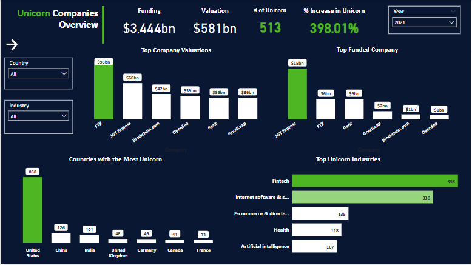

# 🦄 Unicorn Companies Data Analysis

This project analyzes a global dataset of **Unicorn Companies** — private companies valued at **over $1 billion** — using **SQL** for in-depth exploratory data analysis (EDA).  
The goal is to uncover trends in valuations, industries, geography, investors, and growth patterns over time.

---
### DASHBOARD

---

## 📌 Project Objectives

- Perform **Exploratory Data Analysis (EDA)** on unicorn companies.
- Identify key countries, cities, and industries driving unicorn creation.
- Analyze **investor patterns** and leading contributors to high-valuation unicorns.
- Examine the impact of global events (e.g., COVID-19) on unicorn growth.
- Explore **valuation-to-funding efficiency** and timelines to unicorn status.
- Derive actionable **business insights** from trends in the data.

---

## 🗂 Dataset

| Column        | Description |
|---------------|-------------|
| Company       | Company name |
| Valuation2    | Company valuation ($B) |
| Date Joined   | Date company achieved unicorn status |
| Industry      | Industry sector |
| Year Founded  | Year company was founded |
| Funding2      | Total funding raised |
| Country       | Company HQ country |
| City          | Company HQ city |
| Continent     | Company continent |
| Investor 1-4  | Top 4 investors |

---

## 👨‍💻 Tools Used

- **Microsoft SQL Server** — Data querying & analysis
- **Power BI** — Visualization & dashboard (optional)
- **Excel** — Data cleaning (Investor fields)

---

## 🗂 EDA & Analysis Steps
[`Unicorn companies.sql`](./Unicorn%20companies.sql) 
### 1️⃣ General Overview

- Total unicorn companies in dataset
- Min, max, average valuations
- Companies valued **above average**

### 2️⃣ Geographical Insights

- Top **countries** and **cities** by number of unicorns
- % share of unicorns by country & city
- Emerging **innovation hubs** for unicorn creation

### 3️⃣ Industry Trends

- Top industries globally and by continent
- Industries driving the most unicorn creation
- Valuation growth patterns by industry (pre/post 2021)

### 4️⃣ Investor Analysis

- Top investors by number of unicorns funded
- Investor influence by country & city
- **Investor cleaning & transformation** (trim spaces in Excel)

### 5️⃣ Speed to Unicorn

- **Years to unicorn** by company
- Average time to unicorn by industry
- Valuation-to-funding efficiency

### 6️⃣ Temporal Trends

- Yearly growth in unicorn creation
- **2021 spike** → COVID-driven digital transformation
- Post-2021 trends (normalization)

### 7️⃣ Deep Dives

- Unicorn companies founded per year
- Unicorns per industry, per year
- Top investors driving **2021 unicorn boom**

---

## 📈 Key Insights

### 📌 High-level Summary

- Total unicorn companies in dataset: **~1074**
- Companies valued above average: **240**
- Strong **upward trend** in unicorn creation until **2021**, followed by a normalization.
- **US** leads globally with **562 unicorns**; **San Francisco** is the #1 city (148 unicorns).

### 📌 Industry Growth Patterns

| Industry         | Trend |
|------------------|-------|
| Fintech          | 🚀 Explosive growth (11% → 26.7%) |
| AI/Big Data      | 📈 Strong growth |
| SaaS             | 📈 Steady relevance |
| HealthTech       | 🩺 COVID-driven peak in 2020, decline after |
| Biotech          | 🧬 Similar COVID-driven spike |
| E-Commerce       | 🛍️ Pandemic spike, returning to baseline |
| Real Estate Tech | ⬇️ Decline in recent years |
| Manufacturing    | ⬇️ Decline in VC appeal |
| Web3/Blockchain  | 🚀 Hype-driven growth → stabilized |

### 📌 Investor Insights

- Top investors are concentrated in **US and China**.
- Investor funding efficiency varies widely.
- Certain investors consistently back **high-performing industries** (e.g., Fintech, AI).

---

## 🚀 Business Impact

👍 Helps **VC firms** identify rising sectors and investor trends  
👍 Informs **governments and accelerators** about emerging innovation hubs  
👍 Supports **corporate strategy** for market entry and partnership decisions  
👍 Highlights **COVID-19’s impact** on startup ecosystem  
👍 Provides **timeline benchmarks** for founders (time to unicorn)  

---

## 📚 Project Files

- [`Unicorn companies.sql`](./Unicorn%20companies.sql) → Main SQL Analysis Script  
- [`Unicorn companies.pbix`](./Unicorn%20companies.pbix) 

---

## 👥 Acknowledgements

Dataset source: [likely Kaggle or Crunchbase-derived — customize based on your source].  
Thanks to the open data community for enabling unicorn trend analysis.

---

## 💬 Contact

For questions or collaboration opportunities, feel free to connect!

---
